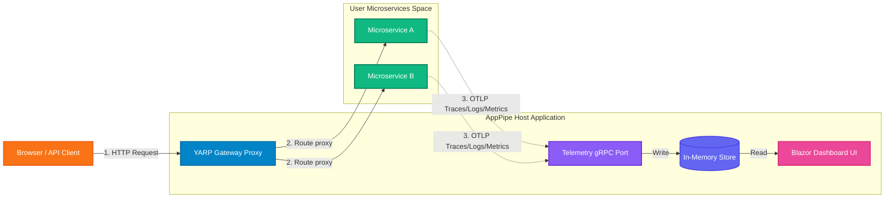

# AppPipe.Hosting 🚀

[](https://www.nuget.org/packages/AppPipe.Hosting)
[](https://www.nuget.org/packages/AppPipe.Hosting)
[](https://github.com/SitholeWB/AppPipe.Hosting/blob/main/LICENSE)

**AppPipe** (similar to *Aspire*) is a lightweight, on-premises alternative to the **.NET Aspire** dashboard and gateway runner. It is designed to orchestrate, route, and collect telemetry for microservice applications deployed on-premises (such as **IIS on Windows** or **systemd on Linux**). 

With AppPipe, you get a beautiful, unified developer dashboard and service discovery proxy without the overhead of cloud-only architectures.

---

## 🌟 Features

- **📊 OpenTelemetry Collector & Dashboard**: Collects OTLP traces, logs, and metrics. Displays them in a gorgeous Blazor dashboard (complete with Light/Dark modes, trace waterfall flamegraphs, structured console logs, and metric charts).
- **💾 SQLite Database Persistence**: Telemetry is persistent by default inside a local SQLite database, surviving gateway restarts and IIS application pool recycles.
- **🔒 Dashboard Security**: Opt-in basic authentication protection for all dashboard and diagnostics routes.
- **📈 Gateway Diagnostics Panel**: A dedicated diagnostics page showing real-time telemetry ingestion rates, active proxy connections, database sizes, and host system information.
- **🔄 Unified Gateway & Routing**: Powered by **YARP (Yet Another Reverse Proxy)**, AppPipe hosts a central routing gateway that automatically maps and proxies requests to your backend microservices.
- **🔌 Dynamic Port Allocation**: Automatically assigns free ports to your applications during local runs or deployment pipelines, preventing port conflict issues.
- **🏢 Native IIS & systemd Integration**: Out-of-the-box deployment module using `ModularPipelines` that automates publishing, creating AppPools, registering IIS sub-applications, setting environment variables, and handling systemd service setups.
- **⚡ Dual Render Modes (Resource-Optimized)**:
  - **Interactive (WebSocket-based)**: Real-time, live-updating metrics and traces.
  - **SSR (Server-Side Rendered)**: WebSockets are disabled to minimize CPU and memory footprint, utilizing native forms and base-relative HTML pages. Perfect for production or restricted IIS host environments.

---

## 📖 Detailed Documentation

For an in-depth dive into how AppPipe works under the hood and how to configure it for production deployment, refer to the **[Complete Features & Configuration Reference Guide](docs/features-and-options.md)**.

It covers:
* ⚙️ **Fluent Topology Options**: Detailed documentation for `.WithEndpoint()`, `.WithAppPool()`, `.WithServiceAccount()`, `.WithReference()`, and other builder methods.
* 🏢 **On-Premises IIS & Service Deployment**: Technical details regarding AppPool permissions, sub-application path matching, self-healing file locks, and the IIS token overwrite startup filter.
* 🐧 **Linux systemd & Reverse Proxy Layouts**: Guidance and auto-generated configurations for systemd units, Nginx location blocks, and Caddy directives.
* 🚀 **DevOps CI/CD Integration**: Guidelines on using `--prepublished-dir` to deploy pre-compiled DLLs directly via GitHub Actions or Azure DevOps pipelines without requiring the .NET SDK on the target server.
* 🛠️ **CLI Troubleshooting & Diagnostic Commands**: PowerShell and CMD commands for testing IIS sites, AppPool recycles, port conflict resolution, and enabling standard output logging.

---

## ⚙️ Architecture



---


### Install the NuGet Packages

To add the library to an existing project:
```bash
dotnet add package AppPipe.Hosting
```

---

## 📦 Project Scaffolding Templates

AppPipe provides a custom `.NET template` pack that scaffolds a fully working multi-project solution structure out of the box (including the AppHost orchestrator, an ApiService backend, and a Web frontend):

### 1. Install the Template Pack
```bash
dotnet new install AppPipe.Hosting.Templates
```

### 2. Scaffold a New System Solution
Create a new directory for your microservices solution and run:
```bash
dotnet new apppipe-system -n MySystem
```

This generates:
* **`MySystem.sln`**: The Visual Studio solution file.
* **`MySystem.AppHost`**: The AppPipe orchestrator and gateway dashboard.
* **`MySystem.ApiService`**: A backend REST API configured with OpenTelemetry.
* **`MySystem.Web`**: A frontend web application that calls the backend using dynamic service discovery.

---

## 🚀 Quick Start

### 1. Define your App Topology
Configure your services and their relationships in your entry point:

```csharp
using AppPipe.Hosting;

var builder = AppPipeHostingApp.CreateBuilder(args);

// Define a backend worker microservice using compile-safe generated constant
var backend = builder.AddProject(AppPipeProjects.BackendWorker);

// Or register directly using raw string name:
// var backend = builder.AddProject("BackendWorker");

// Define a frontend API that communicates with the backend
var frontend = builder.AddProject(AppPipeProjects.FrontendApi)
                      .WithReference(backend); // Injects service discovery variables automatically


var app = builder.Build();

// Run the host using AppPipeDevHostRunner
var runner = new AppPipeDevHostRunner(app);
await runner.RunAsync();
```

### 2. Configure telemetry in your Microservices
In your microservices, register the standard OpenTelemetry exporter. They will automatically detect the telemetry endpoints exposed by the AppPipe Gateway.

```csharp
builder.Services.AddOpenTelemetry()
    .WithTracing(tracing => tracing
        .AddAspNetCoreInstrumentation()
        .AddHttpClientInstrumentation()
        .AddOtlpExporter()) // Exports to AppPipe telemetry port
    .WithMetrics(metrics => metrics
        .AddAspNetCoreInstrumentation()
        .AddHttpClientInstrumentation()
        .AddOtlpExporter());
```

---

## 🛠️ Configuration

You can customize the dashboard, security, and persistence behavior in your `appsettings.json` or environment variables:

```json
{
  "Dashboard": {
    "UseWebSockets": false,
    "BasicAuth": {
      "Enabled": true,
      "Username": "admin",
      "Password": "MySecretPassword"
    }
  },
  "Telemetry": {
    "PersistenceEnabled": true,
    "DatabasePath": "telemetry.db",
    "MaxDbRecords": 2000
  }
}
```

| Key | Type | Default | Description |
| :--- | :--- | :--- | :--- |
| `Dashboard:UseWebSockets` | `bool` | `false` | Set to `true` to enable real-time UI updates via WebSockets. Set to `false` for resource-friendly static HTML rendering. |
| `Dashboard:BasicAuth:Enabled` | `bool` | `false` | Set to `true` to enable Basic Authentication protection for the dashboard and diagnostics. |
| `Dashboard:BasicAuth:Username` | `string` | `null` | The username required to log in when Basic Authentication is enabled. |
| `Dashboard:BasicAuth:Password` | `string` | `null` | The password required to log in when Basic Authentication is enabled. |
| `Telemetry:PersistenceEnabled` | `bool` | `true` | Set to `true` to enable SQLite telemetry database persistence. Set to `false` for purely in-memory buffer. |
| `Telemetry:DatabasePath` | `string` | `telemetry.db` | The path to the persistent SQLite database file. |
| `Telemetry:MaxDbRecords` | `int` | `2000` | Limits database rows retained per telemetry type. |

### 🔄 Configuring the Gateway via YARP
AppPipe's gateway binds natively to standard .NET configuration under the `"ReverseProxy"` section. You can define custom routes, clusters, HTTP request properties, rate-limiting, and transforms inside your `appsettings.json`, or programmatically configure them using `.ConfigureGateway()` in `Program.cs`.

For a complete guide, step-by-step code samples, and auto-generated routing details, see the **[Configuring the Gateway via YARP Guide](docs/features-and-options.md#configuring-the-gateway-via-yarp)**.

---

## 💾 Telemetry Database Persistence & Custom Stores

By default, AppPipe persists all logs, traces, and metrics in a local SQLite database ([SqliteTelemetryStore](AppPipe.Hosting/Gateway/Services/SqliteTelemetryStore.cs)). This database is automatically created and hydrated on startup.

If you want to disable database persistence or plug in another database (such as PostgreSQL, SQL Server, or ClickHouse), you can implement the [ITelemetryStore](AppPipe.Hosting/Gateway/Services/ITelemetryStore.cs) interface and register it:

```csharp
builder.ConfigureGateway(gatewayBuilder =>
{
    // Override the default SQLite persistence with your own database store
    gatewayBuilder.Services.AddSingleton<ITelemetryStore, MyCustomDbTelemetryStore>();
});
```

For complete step-by-step code examples, see the [Custom Telemetry Database Configuration Guide](database-configuration.md).

---

## 🏢 On-Premises Deployment

AppPipe includes a built-in deployment module utilizing `ModularPipelines` to automate publishing and deployments directly to IIS, Windows Services, or Linux `systemd`.

### 1. Customizing Deployment Properties (Fluent Builder)
You can configure environment-specific settings (such as custom IIS AppPools, sites, display names, startup accounts, and hosting models) directly in your orchestrator topology configuration:

```csharp
var backend = builder.AddProject("BackendWorker")
    // IIS & Linux Reverse Proxy Settings
    .WithAppPool("CustomBackendPool")
    .WithIISSite("Default Web Site")
    .WithAppPath("/backend")          // Custom path (IIS virtual path, Nginx location, or Caddy handle_path)
    .WithHostingModel("OutOfProcess") // "InProcess" or "OutOfProcess"
    
    // Windows Service / systemd Settings
    .WithServiceDisplayName("AppPipe Backend Worker Service")
    .WithServiceDescription("AppPipe backend processing service runs tasks.")
    .WithServiceStartType("auto") // "auto", "demand", or "disabled"
    .WithServiceAccount(@"DOMAIN\user")
    .WithServicePassword("secret_password");
```

### 2. Customizing the Dashboard (Host Project)
The dashboard itself is represented as `builder.HostProject` (an instance of `AppPipeHostingProjectResource`) and can be named and configured just like any other microservice:

```csharp
// Set a custom dashboard application name (used for SCM Service name)
builder.HostProject = new AppPipeHostingProjectResource("AppPipeDashboard", "");

// Configure the dashboard options fluently
builder.HostProject.WithEndpoint(7001)
                   .WithIISSite("Default Web Site")
                   .WithAppPath("/")                     // Deployed directly at the root '/' of the site/proxy
                   .WithAppPool("AppPipeDashboardPool")
                   .WithServiceDisplayName("AppPipe Dashboard Orchestrator")
                   .WithServiceDescription("AppPipe gateway and diagnostic telemetry UI.");
```


### 3. Running Local Deployments
To deploy the gateway and microservices directly from your development machine:

```bash
# Deploy to IIS under a custom sub-path
dotnet run --project YourDevHost.csproj -- --deploy iis /app-pipe-host-test

# Deploy as Windows Services
dotnet run --project YourDevHost.csproj -- --deploy windows-service
```

---

## 🚀 DevOps CI/CD Pipelines (Deploying Pre-Compiled DLLs)

In a typical CI/CD pipeline, the build agent compiles the code (creating DLL artifacts), and the release agent downloads the pre-compiled files onto the target environment where **no source code or `.csproj` files exist**.

AppPipe supports this via the `--prepublished-dir` flag and configuration binding.

### 1. CI Stage (Build)
Compile and publish your projects into a target directory (e.g. `./publish`):
```bash
# Publish DevHost (Orchestrator) and child projects
dotnet publish samples/AppPipe.DevHost/AppPipe.DevHost.csproj -c Release -o ./publish/AppPipe.DevHost
dotnet publish samples/BackendWorker/BackendWorker.csproj -c Release -o ./publish/BackendWorker
dotnet publish samples/FrontendApi/FrontendApi.csproj -c Release -o ./publish/FrontendApi
```
Upload the `./publish` directory as a build artifact.

### 2. CD Stage (Deploy)
Download the published artifact to the target server and execute the orchestrator pointing to the pre-compiled folder. This **completely bypasses source code compilation and `.csproj` file searches**:

```bash
dotnet C:\inetpub\apps\AppPipe\AppPipe.DevHost.dll --deploy iis --prepublished-dir C:\inetpub\apps\AppPipe
```

### 3. Handling Environment-Specific Configs & Secrets
To avoid hardcoding values (like AppPool names, Service Accounts, or database passwords) in `Program.cs`, bind your orchestrator to .NET configuration (`IConfiguration`):

```csharp
// Program.cs
var config = new ConfigurationBuilder()
    .AddJsonFile("appsettings.json", optional: true)
    .AddEnvironmentVariables(prefix: "APPIPE__")
    .AddCommandLine(args)
    .Build();

var appPool = config["BackendWorker:AppPoolName"] ?? "DefaultPool";
var password = config["BackendWorker:ServicePassword"]; // Read securely

builder.AddProject("BackendWorker")
       .WithAppPool(appPool)
       .WithServiceAccount(@"DOMAIN\ServiceAccount")
       .WithServicePassword(password);
```

#### Injecting Values securely in your CD pipeline:
* **As Environment Variables**: Map pipeline variables or secrets as environment variables prefixed with `APPIPE__`:
  * `APPIPE__BackendWorker__AppPoolName` $\rightarrow$ `ProductionPool`
  * `APPIPE__BackendWorker__ServicePassword` $\rightarrow$ `$(SecretServicePasswordValue)`
* **As Command-line Arguments**:
  ```bash
  dotnet AppPipe.DevHost.dll --deploy iis --prepublished-dir C:\inetpub\apps\AppPipe --BackendWorker:AppPoolName "ProductionPool" --BackendWorker:ServicePassword "$(SecretServicePasswordValue)"
  ```


---


## 📄 License
This project is licensed under the MIT License - see the [LICENSE](LICENSE) file for details.

