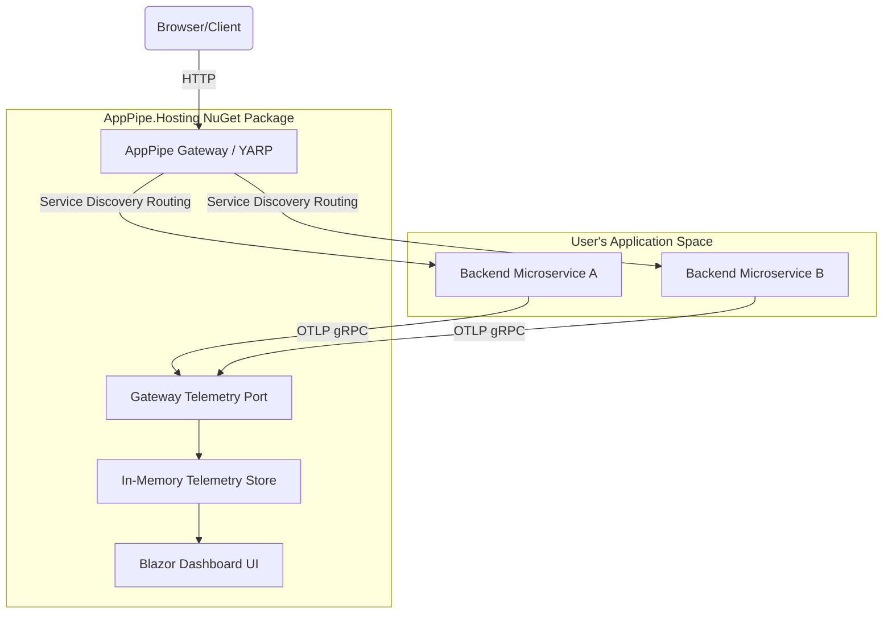

# AppPipe.Hosting 🚀

[](https://www.nuget.org/packages/AppPipe.Hosting)
[](https://www.nuget.org/packages/AppPipe.Hosting)
[](https://github.com/SitholeWB/AppPipe.Hosting/blob/main/LICENSE)

**AppPipe** (also known as *Open-Aspire*) is a lightweight, on-premises alternative to the **.NET Aspire** dashboard and gateway runner. It is designed to orchestrate, route, and collect telemetry for microservice applications deployed on-premises (such as **IIS on Windows** or **systemd on Linux**). 

With AppPipe, you get a beautiful, unified developer dashboard and service discovery proxy without the overhead of cloud-only architectures.

---

## 🌟 Features

- **📊 OpenTelemetry Collector & Dashboard**: Collects OTLP traces, logs, and metrics in-memory from your services. Displays them in a gorgeous Blazor dashboard (complete with Light/Dark modes, trace waterfall flamegraphs, structured console logs, and metric charts).
- **🔀 Unified Gateway & Routing**: Powered by **YARP (Yet Another Reverse Proxy)**, AppPipe hosts a central routing gateway that automatically maps and proxies requests to your backend microservices.
- **🔌 Dynamic Port Allocation**: Automatically assigns free ports to your applications during local runs or deployment pipelines, preventing port conflict issues.
- **🏢 Native IIS & systemd Integration**: Out-of-the-box deployment module using `ModularPipelines` that automates publishing, creating AppPools, registering IIS sub-applications, setting environment variables, and handling systemd service setups.
- **⚡ Dual Render Modes (Resource-Optimized)**:
  - **Interactive (WebSocket-based)**: Real-time, live-updating metrics and traces.
  - **SSR (Server-Side Rendered)**: WebSockets are disabled to minimize CPU and memory footprint, utilizing native forms and base-relative routing. Perfect for production or restricted IIS host environments.

---

## 🏛️ Architecture



---

## 📦 NuGet Package Setup

AppPipe is published as a NuGet package. You can view the author profile at [nuget.org/profiles/sitholewb](https://www.nuget.org/profiles/sitholewb).

### Install the Package

```bash
dotnet add package AppPipe.Hosting
```

---

## 🚀 Quick Start

### 1. Define your App Topology
Configure your services and their relationships in your entry point:

```csharp
using AppPipe.Hosting;

var builder = new AppPipeAppBuilder();

// Define a backend worker microservice
builder.AddProject("BackendWorker", projectPath: "../BackendWorker/BackendWorker.csproj");

// Define a frontend API that communicates with the backend
builder.AddProject("FrontendApi", projectPath: "../FrontendApi/FrontendApi.csproj")
       .WithReference("BackendWorker"); // Service discovery environment variables injected automatically

var app = builder.Build();
await app.RunAsync();
```

### 2. Configure telemetry in your Microservices
In your microservices, register the standard OpenTelemetry exporter. They will automatically detect the telemetry endpoints exposed by the AppPipe Gateway.

```csharp
builder.Services.AddOpenTelemetry()
    .WithTracing(tracing => tracing
        .AddAspNetCoreInstrumentation()
        .AddHttpClientInstrumentation()
        .AddOtlpExporter()) // Exports to AppPipe telemetry port
    .WithMetrics(metrics => metrics
        .AddAspNetCoreInstrumentation()
        .AddHttpClientInstrumentation()
        .AddOtlpExporter());
```

---

## 🛠️ Configuration

You can customize the dashboard and gateway behavior in your `appsettings.json` or environment variables:

```json
{
  "Dashboard": {
    "UseWebSockets": false
  }
}
```

| Key | Type | Default | Description |
| :--- | :--- | :--- | :--- |
| `Dashboard:UseWebSockets` | `bool` | `false` | Set to `true` to enable real-time UI updates via WebSockets. Set to `false` for resource-friendly static HTML rendering. |

---

## 🏢 On-Premises Deployment

AppPipe includes a built-in deployment module to automate builds and deploy directly to IIS or systemd.

### Deploying to IIS (Windows Server)
To deploy the gateway and microservices as sub-applications under a default IIS site:

```bash
dotnet run --project YourDevHost.csproj -- deploy /app-pipe-host-test
```
The pipeline automatically:
1. Stops existing Application Pools to unlock files.
2. Compiles your projects in `Release` mode.
3. Automatically sets up dedicated AppPools and sub-applications in IIS.
4. Generates unique tokens and environments to authenticate intra-app loopback telemetry safely.
5. Restarts the Application Pools.

---

## 👤 Author
Developed and maintained by **Welcome Bonginhlahla Sithole** ([NuGet Profile](https://www.nuget.org/profiles/sitholewb)).

## 📄 License
This project is licensed under the MIT License - see the [LICENSE](LICENSE) file for details.
