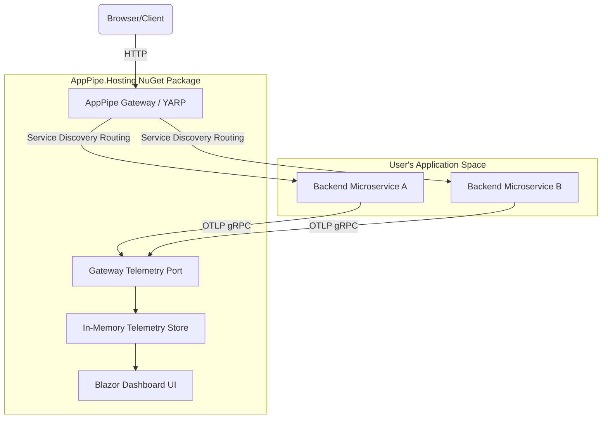

# AppPipe.Hosting 🚀

[](https://www.nuget.org/packages/AppPipe.Hosting)
[](https://www.nuget.org/packages/AppPipe.Hosting)
[](https://github.com/SitholeWB/AppPipe.Hosting/blob/main/LICENSE)

**AppPipe** (similar to *Aspire*) is a lightweight, on-premises alternative to the **.NET Aspire** dashboard and gateway runner. It is designed to orchestrate, route, and collect telemetry for microservice applications deployed on-premises (such as **IIS on Windows** or **systemd on Linux**). 

With AppPipe, you get a beautiful, unified developer dashboard and service discovery proxy without the overhead of cloud-only architectures.

📖 **Detailed Documentation**: For a comprehensive explanation of every configuration setting, fluent builder method, and CI/CD deployment model, please read the [Features & Configuration Reference Guide](file:///D:/Git/Github/AppPipe.Hosting/docs/features-and-options.md).

---

## 🌟 Features

- **📊 OpenTelemetry Collector & Dashboard**: Collects OTLP traces, logs, and metrics in-memory from your services. Displays them in a gorgeous Blazor dashboard (complete with Light/Dark modes, trace waterfall flamegraphs, structured console logs, and metric charts).
- **🔀 Unified Gateway & Routing**: Powered by **YARP (Yet Another Reverse Proxy)**, AppPipe hosts a central routing gateway that automatically maps and proxies requests to your backend microservices.
- **🔌 Dynamic Port Allocation**: Automatically assigns free ports to your applications during local runs or deployment pipelines, preventing port conflict issues.
- **🏢 Native IIS & systemd Integration**: Out-of-the-box deployment module using `ModularPipelines` that automates publishing, creating AppPools, registering IIS sub-applications, setting environment variables, and handling systemd service setups.
- **âš¡ Dual Render Modes (Resource-Optimized)**:
  - **Interactive (WebSocket-based)**: Real-time, live-updating metrics and traces.
  - **SSR (Server-Side Rendered)**: WebSockets are disabled to minimize CPU and memory footprint, utilizing native forms and base-relative routing. Perfect for production or restricted IIS host environments.

---

## 🏛️ Architecture



---


### Install the Nuget Package

```bash
dotnet add package AppPipe.Hosting
```

---

## 🚀 Quick Start

### 1. Define your App Topology
Configure your services and their relationships in your entry point:

```csharp
using AppPipe.Hosting;

var builder = AppPipeApp.CreateBuilder(args);

// Define a backend worker microservice using compile-safe generated constant
var backend = builder.AddProject(Projects.BackendWorker);

// Or register directly using raw string name:
// var backend = builder.AddProject("BackendWorker");

// Define a frontend API that communicates with the backend
var frontend = builder.AddProject(Projects.FrontendApi)
                      .WithReference(backend); // Injects service discovery variables automatically


var app = builder.Build();

// Run the host using DevHostRunner
var runner = new DevHostRunner(app);
await runner.RunAsync();
```

### 2. Configure telemetry in your Microservices
In your microservices, register the standard OpenTelemetry exporter. They will automatically detect the telemetry endpoints exposed by the AppPipe Gateway.

```csharp
builder.Services.AddOpenTelemetry()
    .WithTracing(tracing => tracing
        .AddAspNetCoreInstrumentation()
        .AddHttpClientInstrumentation()
        .AddOtlpExporter()) // Exports to AppPipe telemetry port
    .WithMetrics(metrics => metrics
        .AddAspNetCoreInstrumentation()
        .AddHttpClientInstrumentation()
        .AddOtlpExporter());
```

---

## 🛠️ Configuration

You can customize the dashboard and gateway behavior in your `appsettings.json` or environment variables:

```json
{
  "Dashboard": {
    "UseWebSockets": false
  }
}
```

| Key | Type | Default | Description |
| :--- | :--- | :--- | :--- |
| `Dashboard:UseWebSockets` | `bool` | `false` | Set to `true` to enable real-time UI updates via WebSockets. Set to `false` for resource-friendly static HTML rendering. |

---

## 💾 Customizing the Telemetry Database

By default, AppPipe retains telemetry in a circular in-memory buffer ([InMemoryTelemetryStore](file:///d:/Git/Github/AppPipe.Hosting/AppPipe.Hosting/Gateway/Services/InMemoryTelemetryStore.cs)). For production environments, you can plug in any database (such as SQLite, PostgreSQL, SQL Server, or ClickHouse) by implementing the [ITelemetryStore](file:///d:/Git/Github/AppPipe.Hosting/AppPipe.Hosting/Gateway/Services/ITelemetryStore.cs) interface and registering it:

```csharp
builder.ConfigureGateway(gatewayBuilder =>
{
    gatewayBuilder.Services.AddSingleton<ITelemetryStore, SqliteTelemetryStore>();
});
```

For complete step-by-step code examples, see the [Custom Telemetry Database Configuration Guide](file:///d:/Git/Github/AppPipe.Hosting/database-configuration.md).

---

## 🏢 On-Premises Deployment

AppPipe includes a built-in deployment module utilizing `ModularPipelines` to automate publishing and deployments directly to IIS, Windows Services, or Linux `systemd`.

### 1. Customizing Deployment Properties (Fluent Builder)
You can configure environment-specific settings (such as custom IIS AppPools, sites, display names, startup accounts, and hosting models) directly in your orchestrator topology configuration:

```csharp
var backend = builder.AddProject("BackendWorker")
    // IIS & Linux Reverse Proxy Settings
    .WithAppPool("CustomBackendPool")
    .WithIISSite("Default Web Site")
    .WithAppPath("/backend")          // Custom path (IIS virtual path, Nginx location, or Caddy handle_path)
    .WithHostingModel("OutOfProcess") // "InProcess" or "OutOfProcess"
    
    // Windows Service / systemd Settings
    .WithServiceDisplayName("AppPipe Backend Worker Service")
    .WithServiceDescription("AppPipe backend processing service runs tasks.")
    .WithServiceStartType("auto") // "auto", "demand", or "disabled"
    .WithServiceAccount(@"DOMAIN\user")
    .WithServicePassword("secret_password");
```

### 2. Customizing the Dashboard (Host Project)
The dashboard itself is represented as `builder.HostProject` (an instance of `ProjectResource`) and can be named and configured just like any other microservice:

```csharp
// Set a custom dashboard application name (used for SCM Service name)
builder.HostProject = new ProjectResource("AppPipeDashboard", "");

// Configure the dashboard options fluently
builder.HostProject.WithEndpoint(7001)
                   .WithIISSite("Default Web Site")
                   .WithAppPath("/")                     // Deployed directly at the root '/' of the site/proxy
                   .WithAppPool("AppPipeDashboardPool")
                   .WithServiceDisplayName("AppPipe Dashboard Orchestrator")
                   .WithServiceDescription("AppPipe gateway and diagnostic telemetry UI.");
```


### 3. Running Local Deployments
To deploy the gateway and microservices directly from your development machine:

```bash
# Deploy to IIS under a custom sub-path
dotnet run --project YourDevHost.csproj -- --deploy iis /app-pipe-host-test

# Deploy as Windows Services
dotnet run --project YourDevHost.csproj -- --deploy windows-service
```

---

## 🚀 DevOps CI/CD Pipelines (Deploying Pre-Compiled DLLs)

In a typical CI/CD pipeline, the build agent compiles the code (creating DLL artifacts), and the release agent downloads the pre-compiled files onto the target environment where **no source code or `.csproj` files exist**.

AppPipe supports this via the `--prepublished-dir` flag and configuration binding.

### 1. CI Stage (Build)
Compile and publish your projects into a target directory (e.g. `./publish`):
```bash
# Publish DevHost (Orchestrator) and child projects
dotnet publish samples/AppPipe.DevHost/AppPipe.DevHost.csproj -c Release -o ./publish/AppPipe.DevHost
dotnet publish samples/BackendWorker/BackendWorker.csproj -c Release -o ./publish/BackendWorker
dotnet publish samples/FrontendApi/FrontendApi.csproj -c Release -o ./publish/FrontendApi
```
Upload the `./publish` directory as a build artifact.

### 2. CD Stage (Deploy)
Download the published artifact to the target server and execute the orchestrator pointing to the pre-compiled folder. This **completely bypasses source code compilation and `.csproj` file searches**:

```bash
dotnet C:\inetpub\apps\AppPipe\AppPipe.DevHost.dll --deploy iis --prepublished-dir C:\inetpub\apps\AppPipe
```

### 3. Handling Environment-Specific Configs & Secrets
To avoid hardcoding values (like AppPool names, Service Accounts, or database passwords) in `Program.cs`, bind your orchestrator to .NET configuration (`IConfiguration`):

```csharp
// Program.cs
var config = new ConfigurationBuilder()
    .AddJsonFile("appsettings.json", optional: true)
    .AddEnvironmentVariables(prefix: "APPIPE__")
    .AddCommandLine(args)
    .Build();

var appPool = config["BackendWorker:AppPoolName"] ?? "DefaultPool";
var password = config["BackendWorker:ServicePassword"]; // Read securely

builder.AddProject("BackendWorker")
       .WithAppPool(appPool)
       .WithServiceAccount(@"DOMAIN\ServiceAccount")
       .WithServicePassword(password);
```

#### Injecting Values securely in your CD pipeline:
* **As Environment Variables**: Map pipeline variables or secrets as environment variables prefixed with `APPIPE__`:
  * `APPIPE__BackendWorker__AppPoolName` $\rightarrow$ `ProductionPool`
  * `APPIPE__BackendWorker__ServicePassword` $\rightarrow$ `$(SecretServicePasswordValue)`
* **As Command-line Arguments**:
  ```bash
  dotnet AppPipe.DevHost.dll --deploy iis --prepublished-dir C:\inetpub\apps\AppPipe --BackendWorker:AppPoolName "ProductionPool" --BackendWorker:ServicePassword "$(SecretServicePasswordValue)"
  ```


---


## 📄 License
This project is licensed under the MIT License - see the [LICENSE](LICENSE) file for details.

