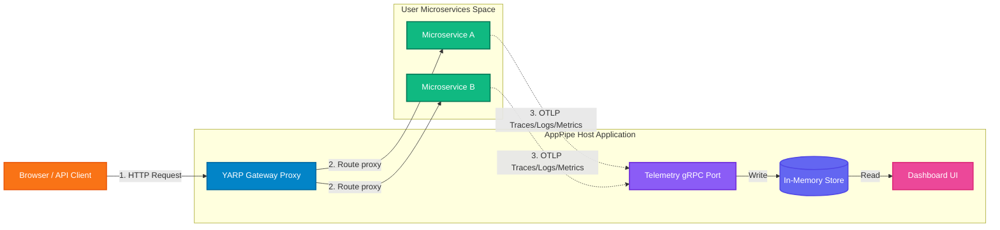

# AppPipe.Hosting 🚀

[](https://www.nuget.org/packages/AppPipe.Hosting)
[](https://www.nuget.org/packages/AppPipe.Hosting)
[](https://github.com/SitholeWB/AppPipe.Hosting/blob/main/LICENSE)

**AppPipe** is a lightweight, zero-container-dependency alternative to the **.NET Aspire** dashboard and gateway runner. 

While **.NET Aspire** is highly optimized for cloud-first deployments and relies heavily on local Docker/container runtimes, **AppPipe** is built specifically for traditional virtual machines, bare-metal servers, and on-premises environments across **Windows (IIS / Windows Services)**, **Linux (systemd / Nginx / Caddy)**, and **macOS**. 

With AppPipe, you get a beautiful, unified developer dashboard, OpenTelemetry (OTLP) collection, and service discovery routing without the container dependencies or cloud-only overhead.

---

## 🌟 Features

- **📊 OpenTelemetry Collector & Dashboard**: Collects OTLP traces, logs, and metrics. Displays them in a gorgeous HTML5/Razor Pages dashboard (complete with Light/Dark modes, trace waterfall flamegraphs, structured console logs, and metric charts).
- **💾 Extensible Database Persistence**: Transitive out-of-the-box telemetry storage via a local SQLite database, with full support for enterprise backends like **PostgreSQL, ClickHouse, SQL Server, MySQL, or Elasticsearch**, as well as a lightweight circular **in-memory** buffer.
- **🔒 Dashboard Security**: Opt-in basic authentication protection for all dashboard and diagnostics routes.
- **📈 Gateway Diagnostics Panel**: A dedicated diagnostics page showing real-time telemetry ingestion rates, active proxy connections, database sizes, and host system information.
- **🔄 Unified Gateway & Routing**: Powered by **YARP (Yet Another Reverse Proxy)**, AppPipe hosts a central routing gateway that automatically maps and proxies requests to your backend microservices.
- **🔌 Dynamic Port Allocation**: Automatically assigns free ports to your applications during local runs or deployment pipelines, preventing port conflict issues.
- **🏢 Multi-Platform Deployment Engines**: Standard built-in modules powered by `ModularPipelines` to automate publishing, creating Windows AppPools, registering IIS sub-applications, setting up Linux `systemd` units, and generating Nginx/Caddy configurations.
- **⚡ Auto-Refresh Controls**: Fully control dashboard background polling using the integrated Auto-Refresh toggle (with configurable timing) to prevent unnecessary CPU/network overhead.

---

## 📖 Detailed Documentation

For an in-depth dive into how AppPipe works under the hood and how to configure it for production deployment, refer to the **[Complete Features & Configuration Reference Guide](docs/features-and-options.md)**.

It covers:
* ⚙️ **Fluent Topology Options**: Detailed documentation for `.WithEndpoint()`, `.WithAppPool()`, `.WithServiceAccount()`, `.WithReference()`, and other builder methods.
* 🏢 **On-Premises IIS & Service Deployment**: Technical details regarding AppPool permissions, sub-application path matching, self-healing file locks, and the IIS token overwrite startup filter.
* 🐧 **Linux systemd & Reverse Proxy Layouts**: Guidance and auto-generated configurations for systemd units, Nginx location blocks, and Caddy directives.
* 🚀 **DevOps CI/CD Integration**: Guidelines on using `--prepublished-dir` to deploy pre-compiled DLLs directly via GitHub Actions or Azure DevOps pipelines without requiring the .NET SDK on the target server.
* 🛠️ **CLI Troubleshooting & Diagnostic Commands**: PowerShell and CMD commands for testing IIS sites, AppPool recycles, port conflict resolution, and enabling standard output logging.

---

## ⚙️ Architecture



---


### Install the NuGet Packages

To add the library to an existing project:
```bash
dotnet add package AppPipe.Hosting
```

---

## 📦 Project Scaffolding Templates

AppPipe provides a custom `.NET template` pack that scaffolds a fully working multi-project solution structure out of the box (including the AppHost orchestrator, an ApiService backend, and a Web frontend):

### 1. Install the Template Pack
```bash
dotnet new install AppPipe.Hosting.Templates
```

### 2. Scaffold a New System Solution
Create a new directory for your microservices solution and run:
```bash
dotnet new app-pipe -n MySystem
```

This generates:
* **`MySystem.sln`**: The Visual Studio solution file.
* **`MySystem.AppHost`**: The AppPipe orchestrator and gateway dashboard.
* **`MySystem.ApiService`**: A backend REST API configured with OpenTelemetry.
* **`MySystem.Web`**: A frontend web application that calls the backend using dynamic service discovery.

### ⚙️ Template Configuration Choices

When scaffolding with `dotnet new app-pipe`, you can customize your architecture, frontend, database, auth, and caching options:

| Parameter | Choice Option | Default | Description |
| :--- | :--- | :--- | :--- |
| **`-ar, --architecture`** | `simple`, `clean-cqrs` | `simple` | Choose `simple` for a Minimal API structure, or `clean-cqrs` for a Clean Architecture layered solution. |
| **`-da, --database`** | `none`, `sqlite`, `postgresql`, `sqlserver` | `none` | Configures Entity Framework Core DB context persistence. |
| **`-f, --frontend`** | `blazor`, `htmx` | `blazor` | Scaffolds either a Blazor Server SSR UI or Razor Pages + HTMX UI, styled with a premium Outfit theme. |
| **`-au, --auth`** | `none`, `jwt` | `none` | Configures JWT Bearer authentication validation middleware and token generation endpoints. |
| **`-c, --caching`** | `none`, `redis` | `none` | Configures Redis distributed caching in command/query handlers. |

For example, to scaffold a full production CQRS architecture with a Blazor frontend, SQLite database, secure JWT authorization, and Redis caching:
```bash
dotnet new app-pipe -n MySystem --architecture clean-cqrs --database sqlite --auth jwt --caching redis
```

---

## 🔌 Integrating AppPipe into Existing Solutions

If you already have an existing .NET microservices solution and want to add AppPipe orchestration, dashboarding, and telemetry, follow these steps:

### Step 1: Create the AppHost Orchestrator Project
Add a new empty .NET Console or Web application project named `YourSolution.AppHost` to your existing solution:
```bash
dotnet new web -n YourSolution.AppHost
```

### Step 2: Add Package and Project References
1. Install the `AppPipe.Hosting` package to the new AppHost project:
   ```bash
   dotnet add YourSolution.AppHost/YourSolution.AppHost.csproj package AppPipe.Hosting
   ```
2. Reference your existing microservices from the AppHost project using standard Project References:
   ```bash
   dotnet add YourSolution.AppHost/YourSolution.AppHost.csproj reference YourExisting.Backend/YourExisting.Backend.csproj
   dotnet add YourSolution.AppHost/YourSolution.AppHost.csproj reference YourExisting.Frontend/YourExisting.Frontend.csproj
   ```

### Step 3: Write the Orchestration Entry Point
Replace the contents of `Program.cs` in the `YourSolution.AppHost` project with:
```csharp
using AppPipe.Hosting;

var builder = AppPipeHostingApp.CreateBuilder(args);

// Register your referenced projects:
// Note: AppPipe automatically generates compile-safe constants for your projects
// (e.g. AppPipeProjects.YourExisting_Backend) during compilation!
var backend = builder.AddProject(AppPipeProjects.YourExisting_Backend)
                     .WithEndpoint(5001); // Assign an entry endpoint port

var frontend = builder.AddProject(AppPipeProjects.YourExisting_Frontend)
                      .WithEndpoint(5002)
                      .WithReference(backend); // Automatically injects discovery environment variables

var app = builder.Build();

// Run the local orchestrator and OTLP collector
var runner = new AppPipeDevHostRunner(app);
await runner.RunAsync();
```

### Step 4: Configure OpenTelemetry in Your Existing Services
In each of your child microservices, add OpenTelemetry OTLP exporters. AppPipe automatically injects the OTLP telemetry ports and service discovery variables as environment values into your processes at run-time:

1. Install the OpenTelemetry packages in your child projects:
   ```bash
   dotnet add package OpenTelemetry.Extensions.Hosting
   dotnet add package OpenTelemetry.Instrumentation.AspNetCore
   dotnet add package OpenTelemetry.Exporter.OpenTelemetryProtocol
   ```
2. Configure it in their `Program.cs`:
   ```csharp
   builder.Services.AddOpenTelemetry()
       .WithTracing(tracing => tracing
           .AddAspNetCoreInstrumentation()
           .AddOtlpExporter()) // Automatically picks up AppPipe gRPC port
       .WithMetrics(metrics => metrics
           .AddAspNetCoreInstrumentation()
           .AddOtlpExporter()); // Automatically picks up AppPipe gRPC port
   ```

---

## 🚀 Quick Start

### 1. Define your App Topology
Configure your services and their relationships in your entry point:

```csharp
using AppPipe.Hosting;

var builder = AppPipeHostingApp.CreateBuilder(args);

// Define a backend worker microservice using compile-safe generated constant
var backend = builder.AddProject(AppPipeProjects.BackendWorker);

// Or register directly using raw string name:
// var backend = builder.AddProject("BackendWorker");

// Define a frontend API that communicates with the backend
var frontend = builder.AddProject(AppPipeProjects.FrontendApi)
                      .WithReference(backend); // Injects service discovery variables automatically


var app = builder.Build();

// Run the host using AppPipeDevHostRunner
var runner = new AppPipeDevHostRunner(app);
await runner.RunAsync();
```

### 2. Configure telemetry in your Microservices
In your microservices, register the standard OpenTelemetry exporter. They will automatically detect the telemetry endpoints exposed by the AppPipe Gateway.

```csharp
builder.Services.AddOpenTelemetry()
    .WithTracing(tracing => tracing
        .AddAspNetCoreInstrumentation()
        .AddHttpClientInstrumentation()
        .AddOtlpExporter()) // Exports to AppPipe telemetry port
    .WithMetrics(metrics => metrics
        .AddAspNetCoreInstrumentation()
        .AddHttpClientInstrumentation()
        .AddOtlpExporter());
```

---

## 🖥️ Accessing the Dashboard

> [!IMPORTANT]
> You must start the **AppHost project** (e.g. `MySystem.AppHost`) — not one of your individual microservices.

Once the AppHost is running, open your browser and navigate to:

```
http://localhost:7001/dashboard
```

The dashboard port `7001` is the default gateway port. If you have changed it in your `appsettings.json`, use the port you configured instead.

### What you'll see

| Page | URL | Description |
| :--- | :--- | :--- |
| **Resources** | `/dashboard` | Service health, latency percentiles (P50/P95/P99), error rates, and data retention |
| **Console Logs** | `/logs` | Structured logs grouped by service with severity filters, full-text search, and CSV export |
| **Traces** | `/traces` | Distributed traces with waterfall timeline, correlated logs, and slow-trace detection |
| **Metrics** | `/metrics` | Live metric charts grouped by service with min/max/avg aggregation |
| **Service Map** | `/service-map` | SVG dependency graph showing service-to-service call flows |

### Starting with the template

If you used the AppPipe template:

```bash
# In Visual Studio — set the AppHost project as the startup project and press F5
# Or via CLI:
cd MySystem.AppHost
dotnet run
```

Then open **http://localhost:7001/dashboard** in your browser.

---


You can customize the dashboard, security, and persistence behavior in your `appsettings.json` or environment variables:

```json
{
  "Dashboard": {
    "UseWebSockets": false,
    "BasicAuth": {
      "Enabled": true,
      "Username": "admin",
      "Password": "MySecretPassword"
    }
  },
  "Telemetry": {
    "PersistenceEnabled": true,
    "DatabasePath": "telemetry.db",
    "MaxDbRecords": 2000
  }
}
```

| Key | Type | Default | Description |
| :--- | :--- | :--- | :--- |
| `Dashboard:UseWebSockets` | `bool` | `false` | Controls live push-updates: when `true`, the dashboard subscribes to `OnTelemetryReceived` events and updates in real time without polling. The dashboard is always fully interactive regardless of this setting. |
| `Dashboard:BasicAuth:Enabled` | `bool` | `false` | Set to `true` to enable Basic Authentication protection for the dashboard and diagnostics. |
| `Dashboard:BasicAuth:Username` | `string` | `null` | The username required to log in when Basic Authentication is enabled. |
| `Dashboard:BasicAuth:Password` | `string` | `null` | The password required to log in when Basic Authentication is enabled. |
| `Telemetry:PersistenceEnabled` | `bool` | `true` | Set to `true` to enable SQLite telemetry database persistence. Set to `false` for purely in-memory buffer. |
| `Telemetry:DatabasePath` | `string` | `telemetry.db` | The path to the persistent SQLite database file. |
| `Telemetry:MaxDbRecords` | `int` | `2000` | Limits database rows retained per telemetry type. |
| `AppPipe:UseGatewayUrls` | `bool` | `null` | If `true`, the dashboard displays links routed through the reverse proxy gateway. If `false`, displays direct process port links. When `null`, automatically defaults to `true` in production/staging environments, and `false` in development environments. |
| `AppPipe:Endpoints:{Resource}`| `string` | `null` | Explicitly overrides a specific resource's dashboard link to use a manual URL (e.g. `AppPipe:Endpoints:BackendWorker` = `"http://backend.internal:5001"`). |

### 🔄 Configuring the Gateway via YARP
AppPipe's gateway binds natively to standard .NET configuration under the `"ReverseProxy"` section. You can define custom routes, clusters, HTTP request properties, rate-limiting, and transforms inside your `appsettings.json`, or programmatically configure them using `.ConfigureGateway()` in `Program.cs`.

For a complete guide, step-by-step code samples, and auto-generated routing details, see the **[Configuring the Gateway via YARP Guide](docs/features-and-options.md#configuring-the-gateway-via-yarp)**.

---

## 🌐 Server-Side URL Resolution

To support various environments and multi-server topologies, the dashboard dynamically computes absolute URLs for registered microservices on the server side:
* **Development Heuristics**: Automatically treats environments like `Development` or `LocalDev` as local debugging sessions, outputting direct Kestrel ports (e.g., `http://localhost:5001`) to bypass gateways.
* **IIS Site Sharing**: Detects if the dashboard and child apps share the same IIS Web Site name (e.g. `"Default Web Site"`), resolving sub-application paths automatically: `scheme://Request.Host{AppPath}`.
* **Standalone Ports**: Falls back to dedicated host ports for standalone websites, Windows Services, and Linux daemons: `scheme://Request.Host.Host:{AssignedPort}`.
* **Dynamic Scale**: Resolves links using visiting HTTP headers, allowing seamless access via private IPs, load-balancer DNS, or domain aliases.
* **Configuration Overrides**: Manually configure explicit endpoints (`AppPipe:Endpoints:{Resource}`) or force gateway URLs using `AppPipe:UseGatewayUrls`.

For detailed information, see the **[Dashboard Server-Side URL Resolution Reference](docs/features-and-options.md#5-server-side-url-resolution)**.

---

## 💾 Extensible Telemetry Storage & Custom Databases

By default, AppPipe persists logs, traces, and metrics in a local SQLite database ([SqliteTelemetryStore](AppPipe.Hosting/Gateway/Services/SqliteTelemetryStore.cs)). This provides zero-configuration persistence out of the box.

However, SQLite is **strictly a default option**. AppPipe is fully database-agnostic. You can easily configure it to run entirely **in-memory** (using a ring buffer) or persist to enterprise databases like **PostgreSQL, ClickHouse, SQL Server, MySQL, or Elasticsearch** by implementing the [ITelemetryStore](AppPipe.Hosting/Gateway/Services/ITelemetryStore.cs) interface and registering it:

```csharp
builder.ConfigureGateway(gatewayBuilder =>
{
    // Override the default SQLite persistence with your custom store
    gatewayBuilder.Services.AddSingleton<ITelemetryStore, ClickHouseTelemetryStore>();
});
```

To run purely in-memory, set `Telemetry:PersistenceEnabled` to `false` in your `appsettings.json`.

For details and step-by-step code examples, see the [Custom Telemetry Database Configuration Guide](database-configuration.md).

---

## 🏢 On-Premises Deployment

AppPipe includes a built-in deployment module utilizing `ModularPipelines` to automate publishing and deployments directly to IIS, Windows Services, or Linux `systemd`.

### 1. Customizing Deployment Properties (Fluent Builder)
You can configure environment-specific settings (such as custom IIS AppPools, sites, display names, startup accounts, and hosting models) directly in your orchestrator topology configuration:

```csharp
var backend = builder.AddProject(AppPipeProjects.BackendWorker)
    // IIS & Linux Reverse Proxy Settings
    .WithAppPool("CustomBackendPool")
    .WithIISSite("Default Web Site")
    .WithAppPath("/backend")          // Custom path (IIS virtual path, Nginx location, or Caddy handle_path)
    .WithHostingModel("OutOfProcess") // "InProcess" or "OutOfProcess"
    
    // Windows Service / systemd Settings
    .WithServiceDisplayName("AppPipe Backend Worker Service")
    .WithServiceDescription("AppPipe backend processing service runs tasks.")
    .WithServiceStartType("auto") // "auto", "demand", or "disabled"
    .WithServiceAccount(@"DOMAIN\user")
    .WithServicePassword("secret_password");
```

### 2. Customizing the Dashboard (Host Project)
The dashboard itself is represented as `builder.HostProject` (an instance of `AppPipeHostingProjectResource`) and can be named and configured just like any other microservice:

```csharp
// Set a custom dashboard application name (used for SCM Service name)
builder.HostProject = new AppPipeHostingProjectResource("AppPipeDashboard");

// Configure the dashboard options fluently
builder.HostProject.WithEndpoint(7001)
                   .WithIISSite("Default Web Site")
                   .WithAppPath("/")                     // Deployed directly at the root '/' of the site/proxy
                   .WithAppPool("AppPipeDashboardPool")
                   .WithServiceDisplayName("AppPipe Dashboard Orchestrator")
                   .WithServiceDescription("AppPipe gateway and diagnostic telemetry UI.");
```

> [!WARNING]
> **Host Project SDK Requirement**: The host project (e.g. `YourDevHost.csproj` or `SocialMedia.AppHost.csproj`) **must** use the `<Project Sdk="Microsoft.NET.Sdk.Web">` SDK. If it is configured as a standard console app SDK (`Microsoft.NET.Sdk`), Razor compilation and Blazor routes will fail, leading to **404 Not Found** errors when attempting to access the dashboard.


### 3. Running Local Deployments
To deploy the gateway and microservices directly from your development machine:

```bash
# Deploy to IIS under a custom sub-path
dotnet run --project YourDevHost.csproj -- --deploy iis /app-pipe-host-test

# Deploy as Windows Services
dotnet run --project YourDevHost.csproj -- --deploy windows-service

# Deploy to IIS Shared Hosting (creates publish/shared-hosting directory and a zip archive)
dotnet run --project YourDevHost.csproj -- --deploy iis-shared

# Deploy to IIS Shared Hosting with automatic FTP sync
dotnet run --project YourDevHost.csproj -- --deploy iis-shared --AppPipe:Deployment:Ftp:Host "ftp.myhost.com" --AppPipe:Deployment:Ftp:Username "user" --AppPipe:Deployment:Ftp:Password "secret"
```

---

## 🚀 DevOps CI/CD Pipelines (Deploying Pre-Compiled DLLs)

In a typical CI/CD pipeline, the build agent compiles the code (creating DLL artifacts), and the release agent downloads the pre-compiled files onto the target environment where **no source code or `.csproj` files exist**.

AppPipe supports this via the `--prepublished-dir` flag and configuration binding.

### 1. CI Stage (Build)
Compile and publish your projects into a target directory (e.g. `./publish`):
```bash
# Publish DevHost (Orchestrator) and child projects
dotnet publish samples/AppPipe.DevHost/AppPipe.DevHost.csproj -c Release -o ./publish/AppPipe.DevHost
dotnet publish samples/BackendWorker/BackendWorker.csproj -c Release -o ./publish/BackendWorker
dotnet publish samples/FrontendApi/FrontendApi.csproj -c Release -o ./publish/FrontendApi
```
Upload the `./publish` directory as a build artifact.

### 2. CD Stage (Deploy)
Download the published artifact to the target server and execute the orchestrator pointing to the pre-compiled folder. This **completely bypasses source code compilation and `.csproj` file searches**:

```bash
dotnet C:\inetpub\apps\AppPipe\AppPipe.DevHost.dll --deploy iis --prepublished-dir C:\inetpub\apps\AppPipe
```

### 3. Handling Environment-Specific Configs & Secrets
To avoid hardcoding values (like AppPool names, Service Accounts, or database passwords) in `Program.cs`, bind your orchestrator to .NET configuration (`IConfiguration`):

```csharp
// Program.cs
var config = new ConfigurationBuilder()
    .AddJsonFile("appsettings.json", optional: true)
    .AddEnvironmentVariables(prefix: "APH__")
    .AddCommandLine(args)
    .Build();

// Configure the Gateway Dashboard Host Project
builder.HostProject = new AppPipeHostingProjectResource(AppPipeProjects.HostProject)
    .WithEndpoint(7001)
    .WithIISSite("Default Web Site")
    .WithAppPath("/")
    .WithAppPool("AppPipeDashboardPool");

var appPool = config["BackendWorker:AppPoolName"] ?? "DefaultPool";
var password = config["BackendWorker:ServicePassword"]; // Read securely

builder.AddProject(AppPipeProjects.BackendWorker)
       .WithAppPool(appPool)
       .WithServiceAccount(@"DOMAIN\ServiceAccount")
       .WithServicePassword(password);
```

#### Injecting Values securely in your CD pipeline:
* **As Environment Variables**: Map pipeline variables or secrets as environment variables prefixed with `APH__`:
  * `APH__BackendWorker__AppPoolName` $\rightarrow$ `ProductionPool`
  * `APH__BackendWorker__ServicePassword` $\rightarrow$ `$(SecretServicePasswordValue)`
* **As Command-line Arguments**:
  ```bash
  dotnet AppPipe.DevHost.dll --deploy iis --prepublished-dir C:\inetpub\apps\AppPipe --BackendWorker:AppPoolName "ProductionPool" --BackendWorker:ServicePassword "$(SecretServicePasswordValue)"
  ```


---

## 🛠️ Developer Guide: Working on the Repository

This section guides developers on how to work inside the AppPipe.Hosting repository, compile the projects, run sample environments, and package/test NuGet templates.

### 1. Prerequisites
- **.NET 10.0 SDK** or higher
- **PowerShell 7** (recommended for package automation)

### 2. Repository Layout
- **`AppPipe.Hosting/`**: Core library (Razor Pages pages, YARP configuration, OTLP listener, SQLite store, process manager).
- **`templates/AppPipeSystemTemplate/`**: Scaffolding source code packaged as `.NET templates`.
- **`samples/`**: Test projects (`AppPipe.DevHost`, `BackendWorker`, `FrontendApi`) used to test the gateway runner and telemetry collection.
- **`tests/`**: Unit and integration test suites.

### 3. Local Run & Debugging
To launch the developer sample environment locally (runs on Windows, Linux, and macOS):
```bash
# Navigate to the DevHost project
cd samples/AppPipe.DevHost

# Start the DevHost orchestrator
dotnet run
```
This command compiles and launches the gateway proxy, boots the microservices on dynamic local ports, registers them, and configures OTLP telemetry back to the dashboard at `http://localhost:7001/dashboard`.

### 4. Generating NuGet Packages
You can pack the AppPipe gateway library and its templates pack locally using the standard .NET CLI:
```bash
# Build the solution in Release mode
dotnet build -c Release

# Pack the core hosting library (generates AppPipe.Hosting.<version>.nupkg in bin/Release)
dotnet pack AppPipe.Hosting/AppPipe.Hosting.csproj -c Release

# Pack the template pack (generates AppPipe.Hosting.Templates.<version>.nupkg)
dotnet pack AppPipe.Hosting.Templates.csproj -c Release
```

### 5. Installing and Testing Local Templates
To verify template edits locally before uploading to NuGet:
```bash
# Register the templates pack from the local folder
dotnet new install templates/AppPipeSystemTemplate

# Check that app-pipe template is listed
dotnet new list app-pipe

# Test scaffolding in a clean folder
mkdir MyTestSystem
cd MyTestSystem
dotnet new app-pipe -n MyTestSystem
```

---

## 📄 License
This project is licensed under the MIT License - see the [LICENSE](LICENSE) file for details.

