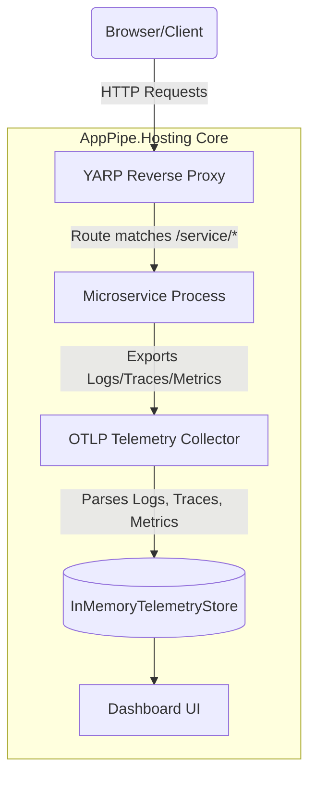

# AppPipe.Hosting: Complete Features & Configuration Reference Guide

This reference guide provides an in-depth explanation of all features, topology options, configuration settings, deployment internals, and CI/CD pipelines available in **AppPipe.Hosting**.

### 🌟 Alternative to Cloud-Only .NET Aspire
While **.NET Aspire** is an excellent framework for microservices, it is heavily tailored for containerized, cloud-first hosting (Docker Desktop, Kubernetes, Azure Container Apps). In contrast, **AppPipe.Hosting** is designed specifically as a **lightweight, zero-container-dependency alternative** for traditional virtual machine (VM), bare-metal, and on-premises hosting environments. 

It runs natively on **Windows (IIS / Windows Services)**, **Linux (systemd / Nginx / Caddy)**, and **macOS** with minimum CPU and memory overhead, requiring no Docker daemon or containerized execution hosts.

---

## ⚙️ Core Features & Capabilities



### 1. YARP-Based Routing & Service Discovery
AppPipe integrates **YARP (Yet Another Reverse Proxy)** to act as the central entry point for all client requests.
* **Catch-all Routing**: When you register a service named `BackendWorker`, AppPipe automatically maps the path `/backendworker/{**catch-all}` to proxy traffic to the assigned port of the backend.
* **Environment Injection**: When a service has a reference to another (declared via `.WithReference(dependency)`), AppPipe injects service discovery environment variables in the format:
  `services__<Name>__http__0` = `http://localhost:<Port>/` (for local runs) or the relative virtual directory path (for IIS).

#### 🔄 Configuring the Gateway via YARP
The AppPipe Gateway binds YARP services directly to the standard .NET `IConfiguration` under the `"ReverseProxy"` section. This enables the user to fully customize routing rules, load balancing, request transforms, and HTTP timeouts.

There are three ways to customize the YARP routing setup:

##### A. In the `appsettings.json` Configuration
Any properties defined under the `"ReverseProxy"` section of your `appsettings.json` are automatically loaded and merged by Kestrel at startup. You can configure custom routes, clusters, HTTP request properties, and transforms:

```json
{
  "ReverseProxy": {
    "Routes": {
      "custom-service-route": {
        "ClusterId": "custom-service-cluster",
        "Match": {
          "Path": "/custom-route/{**catch-all}"
        },
        "Transforms": [
          { "RequestHeader": "X-Gateway-Custom", "Append": "AppPipe" }
        ]
      }
    },
    "Clusters": {
      "custom-service-cluster": {
        "Destinations": {
          "node1": {
            "Address": "http://localhost:5005/"
          }
        }
      }
    }
  }
}
```

##### B. Programmatically via `ConfigureGateway` in `Program.cs`
You can configure YARP proxy rules, CORS policies, rate limiters, or custom destination selection policies in C# by calling `.ConfigureGateway()` on your orchestrator's builder. This provides direct access to the `WebApplicationBuilder`:

```csharp
var builder = AppPipeHostingApp.CreateBuilder(args);

builder.ConfigureGateway(gatewayBuilder =>
{
    // Register custom YARP configuration in-memory or load from a custom provider
    gatewayBuilder.Services.AddReverseProxy()
        .LoadFromMemory(myCustomRoutes, myCustomClusters);

    // Register custom authorization or rate limiter policies that YARP routes can bind to
    gatewayBuilder.Services.AddRateLimiter(options => { ... });
});
```

##### C. Local Development Auto-Generation (`yarp.json`)
For local runs, the `AppPipeDevHostRunner` scans the active topology and automatically writes a `yarp.json` file in the project's root folder, configuring catch-all routing based on your registered microservices and their assigned dynamic ports. This file is loaded at startup to support hot-reloading configurations.


### 2. OTLP Telemetry Collector
AppPipe exposes a local HTTP/2 Kestrel endpoint that acts as a fully compliant **OpenTelemetry (OTLP) Collector** supporting gRPC exports.
* **Zero Configuration**: Microservices configure standard .NET OTLP exporters, which automatically detect and output telemetry to this local gateway.
* **Structured Logs & Traces**: Captures structured console logs, distributed tracing spans, and resource metrics.

### 3. Extensible Telemetry Storage (SQLite as a Default)
By default, telemetry is stored in a local SQLite database (`SqliteTelemetryStore`) so that persistence works out of the box without installing databases. However, this is strictly a default option:
* **Enterprise Database Stores**: Developers can override this default store to persist telemetry to production databases like **PostgreSQL, ClickHouse, SQL Server, MySQL, or Elasticsearch** by implementing the custom `ITelemetryStore` interface.
* **In-Memory Fallback**: SQLite database persistence can be disabled entirely (e.g. for developer builds or ephemeral staging VMs), letting AppPipe fallback to a lightweight circular in-memory buffer (`InMemoryTelemetryStore`) retaining a max cache of 500 items.
* **Bounded Data Pruning**: SQLite and database providers are automatically configured to prune old records, keeping a maximum log, trace, and metric batch limit (defaulting to 500) to keep memory/disk footprints low.

### 4. HTML5 & Razor Pages Dashboard UI
A visual dashboard that allows real-time diagnostics:
* **Waterfalls**: Flamegraphs showing tracing cascades across services.
* **Console Viewer**: Live, searchable stream of logs.
* **Metric Graphs**: Visual charts plotting memory, CPU, and custom metrics.
* **Auto-Refresh controls**: Integrated toggle in the header bar allowing background polling to be easily enabled or paused, operating with a default 10-second frequency to conserve system resources. Works flawlessly under IIS reverse proxies and sub-applications.

---

## 📦 Project Scaffolding Templates

AppPipe provides an installable `.NET template` pack that scaffolds a fully configured multi-project system out of the box.

### 1. Installation
To install the templates from NuGet, run:
```bash
dotnet new install AppPipe.Hosting.Templates
```

### 2. Usage
Create a new directory for your microservices solution and scaffold a system solution using:
```bash
dotnet new app-pipe -n MySystem
```

### 3. Template Configuration Choices

When scaffolding with `dotnet new app-pipe`, you can customize your architecture, frontend, database, auth, and caching options:

| Parameter | Choice Option | Default | Description |
| :--- | :--- | :--- | :--- |
| **`-ar, --architecture`** | `simple`, `clean-cqrs` | `simple` | Choose `simple` for a Minimal API structure, or `clean-cqrs` for a Clean Architecture layered solution. |
| **`-da, --database`** | `none`, `sqlite`, `postgresql`, `sqlserver` | `none` | Configures Entity Framework Core DB context persistence. |
| **`-f, --frontend`** | `blazor`, `htmx` | `blazor` | Scaffolds either a Blazor Server SSR UI or Razor Pages + HTMX UI, styled with a premium Outfit theme. |
| **`-au, --auth`** | `none`, `jwt` | `none` | Configures JWT Bearer authentication validation middleware and token generation endpoints. |
| **`-c, --caching`** | `none`, `redis` | `none` | Configures Redis distributed caching in command/query handlers. |

For example, to scaffold a full production CQRS architecture with a Blazor frontend, SQLite database, secure JWT authorization, and Redis caching:
```bash
dotnet new app-pipe -n MySystem --architecture clean-cqrs --database sqlite --auth jwt --caching redis
```

---

## 🔌 Integrating AppPipe into Existing Solutions

If you already have an existing .NET microservices solution and want to add AppPipe orchestration, dashboarding, and telemetry, follow these steps:

### 1. Create the AppHost Orchestrator Project
Add a new empty .NET Console or Web application project named `YourSolution.AppHost` to your existing solution:
```bash
dotnet new web -n YourSolution.AppHost
```

### 2. Add Package and Project References
1. Install the `AppPipe.Hosting` package to the new AppHost project:
   ```bash
   dotnet add YourSolution.AppHost/YourSolution.AppHost.csproj package AppPipe.Hosting
   ```
2. Reference your existing microservices from the AppHost project using standard Project References:
   ```bash
   dotnet add YourSolution.AppHost/YourSolution.AppHost.csproj reference YourExisting.Backend/YourExisting.Backend.csproj
   dotnet add YourSolution.AppHost/YourSolution.AppHost.csproj reference YourExisting.Frontend/YourExisting.Frontend.csproj
   ```

### 3. Write the Orchestration Entry Point
Replace the contents of `Program.cs` in the `YourSolution.AppHost` project with:
```csharp
using AppPipe.Hosting;

var builder = AppPipeHostingApp.CreateBuilder(args);

// Register your referenced projects:
// Note: AppPipe automatically generates compile-safe constants for your projects
// (e.g. AppPipeProjects.YourExisting_Backend) during compilation!
var backend = builder.AddProject(AppPipeProjects.YourExisting_Backend)
                     .WithEndpoint(5001); // Assign an entry endpoint port

var frontend = builder.AddProject(AppPipeProjects.YourExisting_Frontend)
                      .WithEndpoint(5002)
                      .WithReference(backend); // Automatically injects discovery environment variables

var app = builder.Build();

// Run the local orchestrator and OTLP collector
var runner = new AppPipeDevHostRunner(app);
await runner.RunAsync();
```

### 4. Configure OpenTelemetry in Your Existing Services
In each of your child microservices, add OpenTelemetry OTLP exporters. AppPipe automatically injects the OTLP telemetry ports and service discovery variables as environment values into your processes at run-time:

1. Install the OpenTelemetry packages in your child projects:
   ```bash
   dotnet add package OpenTelemetry.Extensions.Hosting
   dotnet add package OpenTelemetry.Instrumentation.AspNetCore
   dotnet add package OpenTelemetry.Exporter.OpenTelemetryProtocol
   ```
2. Configure it in their `Program.cs`:
   ```csharp
   builder.Services.AddOpenTelemetry()
       .WithTracing(tracing => tracing
           .AddAspNetCoreInstrumentation()
           .AddOtlpExporter()) // Automatically picks up AppPipe gRPC port
       .WithMetrics(metrics => metrics
           .AddAspNetCoreInstrumentation()
           .AddOtlpExporter()); // Automatically picks up AppPipe gRPC port
   ```

---

### 4. Generated Solution Structure
The template creates a solution containing the following pre-integrated projects:
* **`MySystem.AppHost`**: The AppPipe gateway reverse proxy and telemetry dashboard. It references the microservices with decoupled configurations to prevent publish file conflicts.
* **`MySystem.ApiService`**: A backend Minimal API pre-configured to output OpenTelemetry traces, metrics, and logs back to the gateway.
* **`MySystem.Web`**: A frontend web application that calls the backend `ApiService` using dynamic service discovery environment variables injected by AppHost, pre-instrumented with HttpClient tracing.

---

## ⚙️ AppPipeHostingResource Fluent Topology Options

### Project Registration Methods

AppPipe supports two ways to register your microservices in the topology builder:

#### 1. Compile-Safe Project Registration (Recommended)
You can register microservices using strongly-typed string constants generated automatically at build time. 

* **How it works**: You add a standard `<ProjectReference>` to your microservice in the orchestrator's `.csproj` file:
  ```xml
  <ProjectReference Include="..\BackendWorker\BackendWorker.csproj" />
  ```
  AppPipe's built-in target automatically intercepts this and injects:
  - `ReferenceOutputAssembly="false"` (prevents compiling/linking the microservice's assembly).
  - `SkipGetTargetFrameworkProperties="true"` (prevents cross-framework target errors).
  - `Private="false"` (prevents MSBuild from copying any assemblies or content files like `appsettings.json` to the orchestrator's publish folder, avoiding `NETSDK1152` duplicate conflicts).
  
  > [!NOTE]
  > **Referencing Shared Code or Extension Libraries:**
  > If the orchestrator project references a helper library or a shared extension library (e.g. adding extensions to `AppPipeHostingAppBuilder`) that it needs to consume code from, you can disable the automatic decoupling by setting the `AppProject="false"` metadata on the reference:
  > ```xml
  > <ProjectReference Include="..\MySharedLibrary\MySharedLibrary.csproj" AppProject="false" />
  > ```
  
  At build time, AppPipe automatically generates a helper class `AppPipeProjects` containing project names:
  ```csharp
  namespace AppPipe.Hosting
  {
      public static class AppPipeProjects
      {
          public const string BackendWorker = "BackendWorker";
          public const string FrontendApi = "FrontendApi";
      }
  }
  ```
  You can then register the project in `Program.cs` like this:
  ```csharp
  var backend = builder.AddProject(AppPipeProjects.BackendWorker);
  ```
* **Pros**: Refactoring-safe and compile-time validated. If a project is renamed or removed, you will get a compile-time build error. There are no runtime loading dependencies or file copying issues.
* **Cons**: Requires adding decoupled `<ProjectReference>` configurations in the orchestrator project file.

#### 2. Raw String-Based Registration (Fully Decoupled)
If you prefer not to add `<ProjectReference>` items to the orchestrator project file, you can register projects directly using raw string names:
```csharp
var backend = builder.AddProject("BackendWorker");
```
* **How it works**: Searches upwards from `AppContext.BaseDirectory` for the `.sln` or `.slnx` file, and recursively finds the matching `{ProjectName}.csproj` file.
* **Pros**: Complete compilation decoupling. The orchestrator project (`AppPipe.DevHost`) does not need to know about or reference the microservice projects in its `.csproj`.
* **Cons**: No compile-time validation. If you rename the project on disk, you must update the string manually.

---

### API Reference Table


| Fluent Method | Argument Type | Description |
| :--- | :--- | :--- |
| `.WithEndpoint(port)` | `int` | Explicitly binds the application port. If omitted, a free port is dynamically allocated. |
| `.WithEnvironment(key, val)`| `string, string` | Injects custom environment variables into the process. |
| `.WithReference(dep)` | `AppPipeHostingResource` | Sets up service discovery and links the current project to the dependency. |
| `.WaitFor(dep)` | `AppPipeHostingResource` | Delays startup of the resource until the dependency's port is active. |
| `.WithAppPool(name)` | `string` | Sets the custom IIS Application Pool name for this service. |
| `.WithIISSite(siteName)` | `string` | Sets the target IIS Site (defaults to `"Default Web Site"`). |
| `.WithAppPath(path)` | `string` | Sets the custom virtual application path. For Windows IIS, this maps to the sub-application virtual path under the site (e.g. `"/api"`). For Linux Nginx and Caddy reverse proxies, this determines the location routing block path (e.g. `location /api/`). Empty string `""` or `"/"` deploys the app directly as the root application (`/`) of the site/proxy. |
| `.WithHostingModel(model)` | `string` | Sets the IIS hosting model (`"InProcess"` or `"OutOfProcess"`). |
| `.WithServiceDisplayName(name)`| `string` | Sets the Windows Service Manager (SCM) Display Name. |
| `.WithServiceDescription(desc)`| `string` | Sets the SCM / systemd service description. |
| `.WithServiceStartType(type)` | `string` | SCM startup trigger (`"auto"`, `"demand"`, or `"disabled"`). |
| `.WithServiceAccount(account)` | `string` | SCM/AppPool user identity (e.g. `LocalSystem`, `NetworkService`, or domain accounts like `DOMAIN\user`). |
| `.WithServicePassword(pwd)` | `string` | Password matching the custom domain/local user identity. |

---

## 💻 Full End-to-End Orchestrator Example (`Program.cs`)

Below is a complete, production-ready `Program.cs` orchestrator topology showing configuration binding, dashboard customization, and fluent resource definition:

```csharp
using System;
using System.Threading.Tasks;
using Microsoft.Extensions.Configuration;
using AppPipe.Hosting;

namespace AppPipe.DevHost;

internal class Program
{
    private static async Task Main(string[] args)
    {
        // 1. Initialize .NET Configuration Builder
        var config = new ConfigurationBuilder()
            .AddJsonFile("appsettings.json", optional: true)
            .AddJsonFile($"appsettings.{Environment.GetEnvironmentVariable("DOTNET_ENVIRONMENT")}.json", optional: true)
            .AddEnvironmentVariables(prefix: "APPIPE__") // e.g. APPIPE__BackendWorker__ServicePassword
            .AddCommandLine(args)
            .Build();

        // 2. Initialize the AppPipe App Builder
        var builder = AppPipeHostingApp.CreateBuilder(args);

        // 3. Customize and configure the Dashboard itself (HostProject)
        var dashboardName = config["Dashboard:Name"] ?? "AppPipeDashboard";
        builder.HostProject = new AppPipeHostingProjectResource(dashboardName, "")
            .WithEndpoint(7001)
            .WithIISSite(config["Dashboard:IISSiteName"] ?? "Default Web Site")
            .WithAppPath(config["Dashboard:AppPath"] ?? "/") // Deployed at root site level '/'
            .WithAppPool(config["Dashboard:AppPoolName"] ?? "AppPipeDashboardPool")
            .WithServiceDisplayName("AppPipe Telemetry Dashboard")
            .WithServiceDescription("Orchestrates AppPipe microservices and renders telemetry.");

        // 4. Register and configure BackendWorker
        var backendPassword = config["BackendWorker:ServicePassword"];
        var backend = builder.AddProject("BackendWorker")
            .WithEndpoint(7002)
            .WithEnvironment("LOG_LEVEL", "Debug")
            .WithAppPool(config["BackendWorker:AppPoolName"] ?? "CustomBackendPool")
            .WithIISSite(config["BackendWorker:IISSiteName"] ?? "Default Web Site")
            .WithAppPath("/backend") // Deployed under /backend instead of /BackendWorker
            .WithServiceDisplayName("AppPipe Backend Worker Service")
            .WithServiceDescription("Processes long-running background tasks and OTLP logs.")
            .WithServiceStartType("auto")
            .WithServiceAccount(config["BackendWorker:ServiceAccount"] ?? "LocalSystem")
            .WithServicePassword(backendPassword);

        // 5. Register and configure FrontendApi (declaring dependency on BackendWorker)
        var frontend = builder.AddProject("FrontendApi")
            .WithReference(backend) // Auto-injects connection variables
            .WithEndpoint(7003)
            .WithEnvironment("LOG_LEVEL", "Debug")
            .WithAppPool(config["FrontendApi:AppPoolName"] ?? "CustomFrontendPool")
            .WithIISSite(config["FrontendApi:IISSiteName"] ?? "Default Web Site")
            .WithServiceDisplayName("AppPipe Frontend API Service")
            .WithServiceDescription("Public-facing gateway and endpoint handler.")
            .WithServiceStartType("auto");

        // 5b. (Optional) Register Node/React/Angular frontend application using the new AddFrontendApp helper:
        // builder.AddFrontendApp("ReactUI", "./src/ui", PackageManager.Yarn, "start");
        // Or using custom commands (like dotnet watch or yarn workspace):
        // builder.AddFrontendApp("WorkerWatch", "./src/worker", "dotnet watch run --project ./src/worker/worker.csproj");

        // 6. Build the application graph
        var app = builder.Build();

        // 7. Parse execution targets
        if (args.Length > 0 && args[0].StartsWith("--deploy"))
        {
            var targetStr = args.Length > 1 ? args[1] : "iis";
            var deployPath = args.Length > 2 ? args[2] : "";

            var target = targetStr.ToLower() switch
            {
                "windows-service" or "service" => DeploymentTarget.WindowsService,
                "iis" => DeploymentTarget.IIS,
                "linux-service" or "systemd" => DeploymentTarget.LinuxService,
                "linux-nginx" => DeploymentTarget.LinuxNginx,
                "linux-caddy" => DeploymentTarget.LinuxCaddy,
                _ => throw new ArgumentException($"Unknown deployment target: {targetStr}")
            };

            await OnPremDeployer.CompileToOnPremAsync(app, target, deployPath);
        }
        else if (Environment.GetEnvironmentVariable("APP_POOL_ID") != null || 
                 Environment.GetEnvironmentVariable("WINDOWS_SERVICE") == "true")
        {
            // Running inside IIS/Service environment. Run Dashboard gateway only.
            var gateway = new GatewayAppPipeHost();
            await gateway.StartAsync(string.Empty, app, app.ConfigureGatewayAction);
            await Task.Delay(-1); // Keep alive
        }
        else
        {
            // Running locally for development
            var runner = new AppPipeDevHostRunner(app);
            await runner.RunAsync();
        }
    }
}
```

---

## 📄 Reference Configuration Layout (`appsettings.json`)

You can define all environment-specific parameters inside your deployment `appsettings.json`:

```json
{
  "Dashboard": {
    "Name": "ProductionDashboard",
    "IISSiteName": "Default Web Site",
    "AppPoolName": "ProductionDashboardPool",
    "UseWebSockets": false,
    "BasicAuth": {
      "Enabled": true,
      "Username": "admin",
      "Password": "MySecretPasswordReference"
    }
  },
  "Telemetry": {
    "PersistenceEnabled": true,
    "DatabasePath": "telemetry.db",
    "MaxDbRecords": 2000
  },
  "BackendWorker": {
    "IISSiteName": "Default Web Site",
    "AppPoolName": "ProdBackendPool",
    "ServiceAccount": "DOMAIN\\SvcBackend",
    "ServicePassword": "MySecretPasswordReference"
  },
  "FrontendApi": {
    "IISSiteName": "Default Web Site",
    "AppPoolName": "ProdFrontendPool"
  }
}
```

---

## 🏢 On-Premises Deployment Targets (IIS & Service Internals)

### 1. IIS Deployments
* **Virtual Directories**: Registers the orchestrator (Dashboard) and microservices as sub-applications under the specified IIS Site.
* **AppPool Setup**: Creates custom AppPools and binds them to the configured identities.
* **Identity Customization**: 
  * If a built-in account (e.g., `NetworkService`, `ApplicationPoolIdentity`) is set via `WithServiceAccount`, AppPool processes are configured natively to use that type.
  * If a custom account is set, the AppPool switches to `SpecificUser` and applies the user's domain username and password.
* **Self-Healing File Locking**: The build pipeline automatically runs `iisreset /stop` and stops services. It polls for 10 seconds to release file locks on the output DLLs, falling back to process termination (`Process.Kill()`) if the locks persist, ensuring future updates compile without error.
* **IIS Token Overwrite Filter**: Intercepts OTLP telemetry calls and overrides mismatches of the `MS-ASPNETCORE-TOKEN` header across different AppPools, allowing telemetry loopbacks to bypass IIS security filters.

### 2. Windows Service Deployments
* Uses native `sc.exe` executions with flat argument tokens to cleanly register the service executables.
* Configures the service name, display name, description, startup type (`auto`/`demand`), and the service execution context (RunAs credentials and passwords).

### 3. Linux systemd & Reverse Proxy Configs
* Generates systemd service unit files (`.service`) dynamically.
* If `ServiceAccount` is configured, it injects `User=<account>` in the Service section to control process execution safety.
* Automatically creates target deployment scripts/configs for **Nginx** and **Caddy** reverse proxies.

---

## 🚀 DevOps CI/CD Pipelines (Deploying Pre-Compiled DLLs)

In professional DevOps environments, you separate compilation from deployment. 

### 1. Bypassing Compilation on the Target Server
By default, AppPipe looks for `.csproj` files to run compilation on-the-fly. On your production target server, this fails as you only have compiled files.
* **The Solution**: Use the `--prepublished-dir <path>` parameter:
  ```bash
  dotnet AppPipe.DevHost.dll --deploy iis --prepublished-dir C:\inetpub\apps\AppPipe
  ```
* **Effect**: Bypasses the `.csproj` check and skips the `PublishProjectsModule` entirely, directly configuring the pre-compiled directories in IIS or Windows Services.

### 2. DevOps Pipeline Examples

#### A. GitHub Actions (YAML)
This workflow builds the projects on the runner and executes the deployment script on a Windows Self-Hosted runner:

```yaml
name: AppPipe On-Prem IIS Deployment

on:
  push:
    branches: [ main ]

jobs:
  build:
    name: Build & Package Artifacts
    runs-on: ubuntu-latest
    steps:
    - uses: actions/checkout@v3
    
    - name: Setup .NET
      uses: actions/setup-dotnet@v3
      with:
        dotnet-version: '8.0.x'
        
    - name: Publish All Services
      run: |
        dotnet publish samples/AppPipe.DevHost/AppPipe.DevHost.csproj -c Release -o ./publish/AppPipe.DevHost
        dotnet publish samples/BackendWorker/BackendWorker.csproj -c Release -o ./publish/BackendWorker
        dotnet publish samples/FrontendApi/FrontendApi.csproj -c Release -o ./publish/FrontendApi
        
    - name: Upload Artifact
      uses: actions/upload-artifact@v3
      with:
        name: apppipe-packages
        path: ./publish

  deploy:
    name: Deploy to Production Server
    needs: build
    runs-on: [self-hosted, windows] # Self-hosted runner installed on the IIS web server
    steps:
    - name: Download Artifacts
      uses: actions/download-artifact@v3
      with:
        name: apppipe-packages
        path: C:\inetpub\apps\AppPipe
        
    - name: Run AppPipe IIS Deployer
      run: |
        dotnet C:\inetpub\apps\AppPipe\AppPipe.DevHost\AppPipe.DevHost.dll --deploy iis --prepublished-dir C:\inetpub\apps\AppPipe
      env:
        # Securely inject environment configuration and secrets
        APPIPE__Dashboard__UseWebSockets: "false"
        APPIPE__BackendWorker__AppPoolName: "ProductionBackendPool"
        APPIPE__BackendWorker__ServiceAccount: "DOMAIN\\SvcAccount"
        APPIPE__BackendWorker__ServicePassword: ${{ secrets.IIS_SVC_ACCOUNT_PASSWORD }}
```

#### B. Azure DevOps (YAML)
A similar configuration setup utilizing Azure Pipelines environment environments and secure variables:

```yaml
trigger:
- main

variables:
  # Secret variables like $(iis.svc.password) are configured in the Azure DevOps Variable Group
  APPIPE__BackendWorker__ServicePassword: $(iis.svc.password)
  APPIPE__BackendWorker__ServiceAccount: 'DOMAIN\SvcAccount'
  APPIPE__BackendWorker__AppPoolName: 'ProductionBackendPool'

stages:
- stage: BuildStage
  jobs:
  - job: BuildJob
    pool:
      vmImage: 'windows-latest'
    steps:
    - task: DotNetCoreCLI@2
      displayName: 'Publish Orchestrator'
      inputs:
        command: 'publish'
        publishWebProjects: false
        projects: 'samples/AppPipe.DevHost/AppPipe.DevHost.csproj'
        arguments: '-c Release -o $(Build.ArtifactStagingDirectory)/AppPipe.DevHost'
        
    - task: DotNetCoreCLI@2
      displayName: 'Publish BackendWorker'
      inputs:
        command: 'publish'
        publishWebProjects: false
        projects: 'samples/BackendWorker/BackendWorker.csproj'
        arguments: '-c Release -o $(Build.ArtifactStagingDirectory)/BackendWorker'

    - task: DotNetCoreCLI@2
      displayName: 'Publish FrontendApi'
      inputs:
        command: 'publish'
        publishWebProjects: false
        projects: 'samples/FrontendApi/FrontendApi.csproj'
        arguments: '-c Release -o $(Build.ArtifactStagingDirectory)/FrontendApi'

    - task: PublishBuildArtifacts@1
      inputs:
        PathtoPublish: '$(Build.ArtifactStagingDirectory)'
        ArtifactName: 'drop'

- stage: DeployStage
  dependsOn: BuildStage
  jobs:
  - deployment: DeployIIS
    pool:
      name: 'OnPremServersPool' # Deployment group target pool on-premises
    environment: 'Production'
    strategy:
      runOnce:
        deploy:
          steps:
          - task: DownloadBuildArtifacts@1
            inputs:
              buildType: 'current'
              downloadType: 'single'
              artifactName: 'drop'
              downloadPath: 'C:\inetpub\apps\AppPipe'
              
          - task: PowerShell@2
            displayName: 'Execute Deployer'
            inputs:
              targetType: 'inline'
              script: |
                dotnet C:\inetpub\apps\AppPipe\drop\AppPipe.DevHost\AppPipe.DevHost.dll --deploy iis --prepublished-dir C:\inetpub\apps\AppPipe\drop
            env:
              # Secret bindings are automatically mapped via variables
              APPIPE__BackendWorker__ServicePassword: $(APPIPE__BackendWorker__ServicePassword)
```

---

## 🛠️ CLI Troubleshooting & Verification Commands

Here are common diagnostic commands to execute when checking on-premises status:

### 1. Querying IIS Status via Command Line
Run these from an Administrator Command Prompt to verify sites and application pools:

```bash
# List all running IIS Application Pools
C:\windows\system32\inetsrv\appcmd.exe list apppool

# List all applications and their physical paths
C:\windows\system32\inetsrv\appcmd.exe list app /text:*

# Recycle a specific AppPool
C:\windows\system32\inetsrv\appcmd.exe recycle apppool /apppool.name:ProductionBackendPool
```

### 2. Troubleshooting Port Conflicts (Error 502.5 / Socket Exceptions)
If your AppPool fails to start or crashes immediately due to a `SocketException (10048)`, verify if another service is holding the OTLP port:

```powershell
# In PowerShell: find what process ID is holding the target port (e.g. 63304)
Get-NetTCPConnection -LocalPort 63304 | Select-Object LocalPort, State, OwningProcess

# Get the process details by ID
Get-Process -Id <OwningProcessId>

# Stop Windows Services that might be conflicting
sc.exe stop AppPipeDashboard
sc.exe stop BackendWorker
sc.exe stop FrontendApi
```

### 3. Reading IIS Application stdout Logs
If the AppPool is failing, enable standard output logging by editing the `web.config` inside your published folder:

1. Open `web.config` and change `stdoutLogEnabled` to `true`:
   ```xml
   <aspNetCore processPath="dotnet" arguments=".\AppPipe.DevHost.dll" stdoutLogEnabled="true" stdoutLogFile=".\logs\stdout" ... />
   ```
2. Create a folder named `logs` in the published root directory.
3. Access the application in the browser and read the crash log output saved in `.\logs\stdout_xxxxx.log`.


---

## 🔧 Customizing the Deployment Pipeline with ModularPipelines

AppPipe's deployment engine is built on top of **ModularPipelines**—a type-safe, asynchronous C# build and deployment pipeline framework. Since all deployment modules (e.g., publishing, IIS mapping, systemd config) are public classes, you can leverage standard ModularPipelines features or inject your own custom modules.

### Option 1: Using the `OnPremDeployer` Delegate (Recommended)
You can pass an optional `Action<PipelineHostBuilder>` delegate to `OnPremDeployer.CompileToOnPremAsync`. This allows you to register custom modules or services on the container:

```csharp
// Program.cs inside your AppHost project
await OnPremDeployer.CompileToOnPremAsync(app, target, deployPath, pipelineBuilder =>
{
    pipelineBuilder.ConfigureServices((context, services) =>
    {
        // 1. Add your custom ModularPipelines modules
        services.AddModule<RunDbMigrationsModule>();
        services.AddModule<NotifySlackOnCompletionModule>();
    });
});
```

Here is an example of a custom module that notifies Slack after the deployment completes:

```csharp
using System.Net.Http;
using System.Net.Http.Json;
using ModularPipelines.Attributes;
using ModularPipelines.Context;
using ModularPipelines.Modules;

// DependsOn guarantees this module executes AFTER the IIS/Linux module completes
[DependsOn<WindowsIISDeploymentModule>]
public class NotifySlackOnCompletionModule : Module<HttpResponseMessage>
{
    protected override async Task<HttpResponseMessage?> ExecuteAsync(IPipelineContext context, CancellationToken cancellationToken)
    {
        context.Logger.LogInformation("Sending Slack notification...");
        
        using var client = new HttpClient();
        var response = await client.PostAsJsonAsync("https://hooks.slack.com/services/YOUR/WEBHOOK/URL", new
        {
            text = "🚀 AppPipe Microservices successfully deployed on-premises!"
        }, cancellationToken);
        
        return response;
    }
}
```

### Option 2: Composing a Custom Pipeline from Scratch
If you want absolute control over the pipeline execution structure, you can bypass `OnPremDeployer` entirely and build your own pipeline using `PipelineHostBuilder.Create()`, registering AppPipe's built-in modules alongside your own:

```csharp
using ModularPipelines.Host;
using AppPipe.Hosting;

var app = builder.Build();

var pipeline = await PipelineHostBuilder.Create()
    .ConfigureServices((context, services) =>
    {
        services.AddSingleton(app);
        services.AddSingleton(new DeploymentOptions { Target = DeploymentTarget.IIS });

        // Register AppPipe default modules
        services.AddModule<PublishProjectsModule>();
        services.AddModule<WindowsIISDeploymentModule>();

        // Register custom modules
        services.AddModule<BackupFolderModule>();
        services.AddModule<RunDbMigrationsModule>();
    })
    .ExecutePipelineAsync();
```

---

## 🛠️ Developer Guide: Working on the Repository

This section guides developers on how to work inside the AppPipe.Hosting repository, compile the projects, run sample environments, and package/test NuGet templates.

### 1. Prerequisites
- **.NET 10.0 SDK** or higher
- **PowerShell 7** (recommended for package automation)

### 2. Repository Layout
- **`AppPipe.Hosting/`**: Core library (Razor Pages pages, YARP configuration, OTLP listener, SQLite store, process manager).
- **`templates/AppPipeSystemTemplate/`**: Scaffolding source code packaged as `.NET templates`.
- **`samples/`**: Test projects (`AppPipe.DevHost`, `BackendWorker`, `FrontendApi`) used to test the gateway runner and telemetry collection.
- **`tests/`**: Unit and integration test suites.

### 3. Local Run & Debugging
To launch the developer sample environment locally (runs on Windows, Linux, and macOS):
```bash
# Navigate to the DevHost project
cd samples/AppPipe.DevHost

# Start the DevHost orchestrator
dotnet run
```
This command compiles and launches the gateway proxy, boots the microservices on dynamic local ports, registers them, and configures OTLP telemetry back to the dashboard at `http://localhost:7001/dashboard`.

### 4. Generating NuGet Packages
You can pack the AppPipe gateway library and its templates pack locally using the standard .NET CLI:
```bash
# Build the solution in Release mode
dotnet build -c Release

# Pack the core hosting library (generates AppPipe.Hosting.<version>.nupkg in bin/Release)
dotnet pack AppPipe.Hosting/AppPipe.Hosting.csproj -c Release

# Pack the template pack (generates AppPipe.Hosting.Templates.<version>.nupkg)
dotnet pack AppPipe.Hosting.Templates.csproj -c Release
```

### 5. Installing and Testing Local Templates
To verify template edits locally before uploading to NuGet:
```bash
# Register the templates pack from the local folder
dotnet new install templates/AppPipeSystemTemplate

# Check that app-pipe template is listed
dotnet new list app-pipe

# Test scaffolding in a clean folder
mkdir MyTestSystem
cd MyTestSystem
dotnet new app-pipe -n MyTestSystem
```

